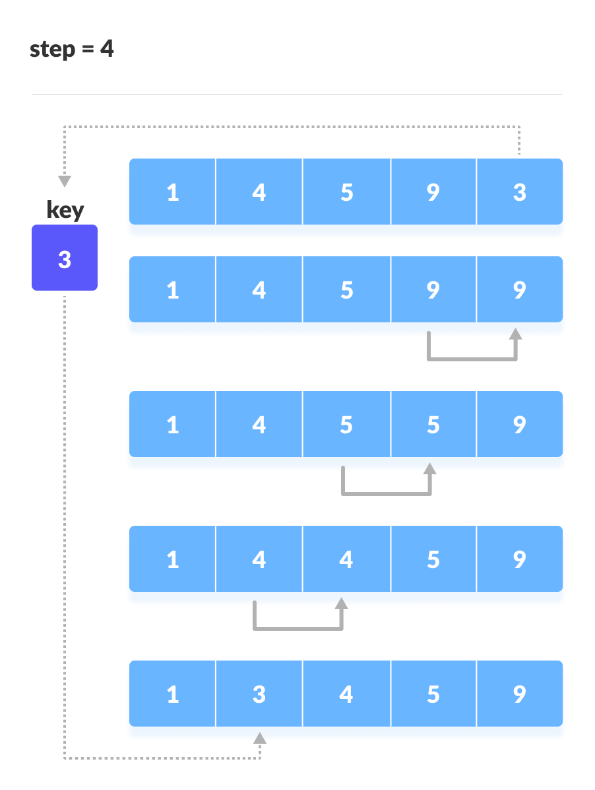

# Insertion Sort Algorithm

## What is Insertion Sort ?

Insertion sort is a sorting algorithm that places an unsorted element at its suitable place in each iteration.

## Pre-Requisites
- Knowledge of Arrays
- Knowledge of Function

## Explanation

Suppose we need to sort the following array.


1. The first element in the array is assumed to be sorted. Take the second element and store it separately in key.
Compare key with the first element. If the first element is greater than key, then key is placed in front of the first element.


2. Now, the first two elements are sorted.
Take the third element and compare it with the elements on the left of it. Placed it just behind the element smaller than it. If there is no element smaller than it, then place it at the beginning of the array.


3. Similarly, place every unsorted element at its correct position.





## Pseudo code
```
insertionSort(array){
    mark first element as sorted

    for each unsorted element X
        'extract' the element X
        for j <- lastSortedIndex down to 0

            if current element j > X
                move sorted element to the right by 1

        break loop and insert X here
}
```

## External content

- [Explanation by Geeks for Geeks](https://www.geeksforgeeks.org/insertion-sort/)

---
