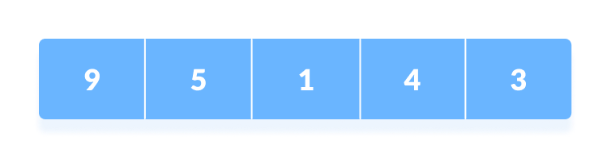
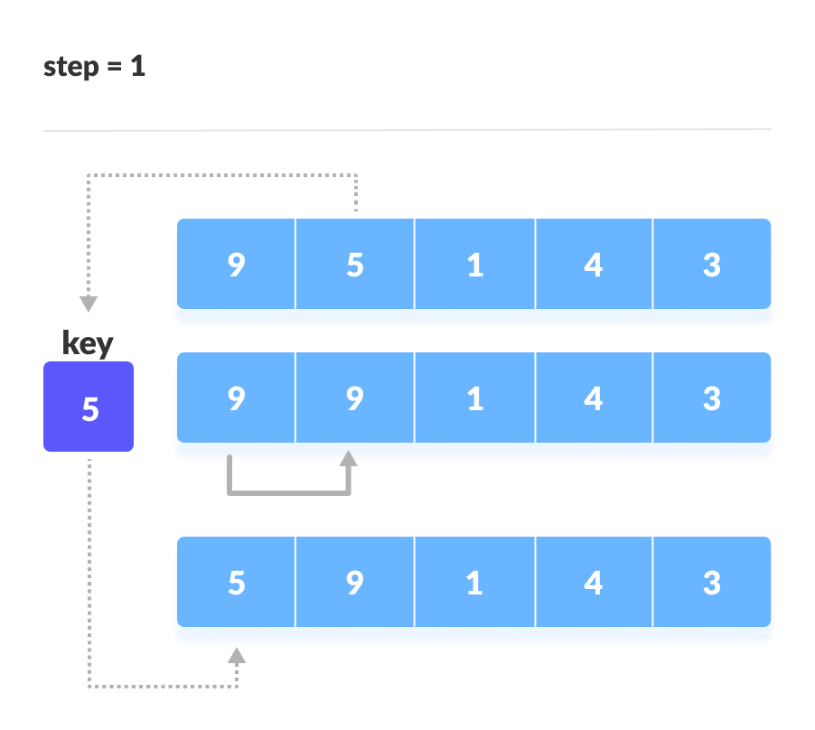
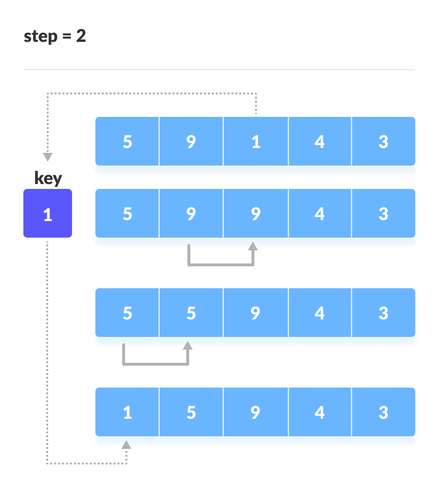

# Insertion Sort Algorithm

## What is Insertion Sort ?

Insertion sort is a sorting algorithm that places an unsorted element at its suitable place in each iteration.

## Pre-Requisites
- Knowledge of Arrays
- Knowledge of Function

## Explanation

Suppose we need to sort the following array.


1. The first element in the array is assumed to be sorted. Take the second element and store it separately in key.
Compare key with the first element. If the first element is greater than key, then key is placed in front of the first element.


2. Now, the first two elements are sorted.
Take the third element and compare it with the elements on the left of it. Placed it just behind the element smaller than it. If there is no element smaller than it, then place it at the beginning of the array.


3. Similarly, place every unsorted element at its correct position.


Include pictorial representation, pictures as required.
Also, add steps to solve under this like

-   This is step 1
-   This is step 2
-   Use `code` this to mention function, variable names

## Pseudo code

You can add the psuedo code all at once in here, in above section only add steps in a descriptive manner.

```
  You can use block code highlighting for this
  (IF REQUIRED)
```

## External content

Add links to other websites, visualizers using this [way to represent a link](https://thisisalink.com)

---
