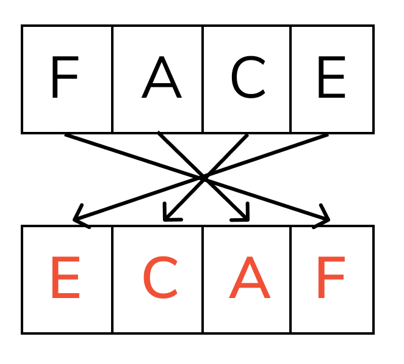

# Algo Name

## Question

An algorithm that checks whether the input (positive integer) is a palindrome or not. i.e it spells the same way when it is reversed.

## Explanation

The idea is that you take an input then reverse it. Then you compare both and check whether they're the same. If so, the input was a palindrome.



## Pseudo code

```
  INPUT number
  
  reversed <-- number
  reversed <-- REVERSE(reversed)

  IF number = reversed THEN
    OUTPUT "The Number entered was a Palindrome"
  ELSE
    OUTPUT "The Number entered was NOT a Palindrome"
  ENDIF
```
