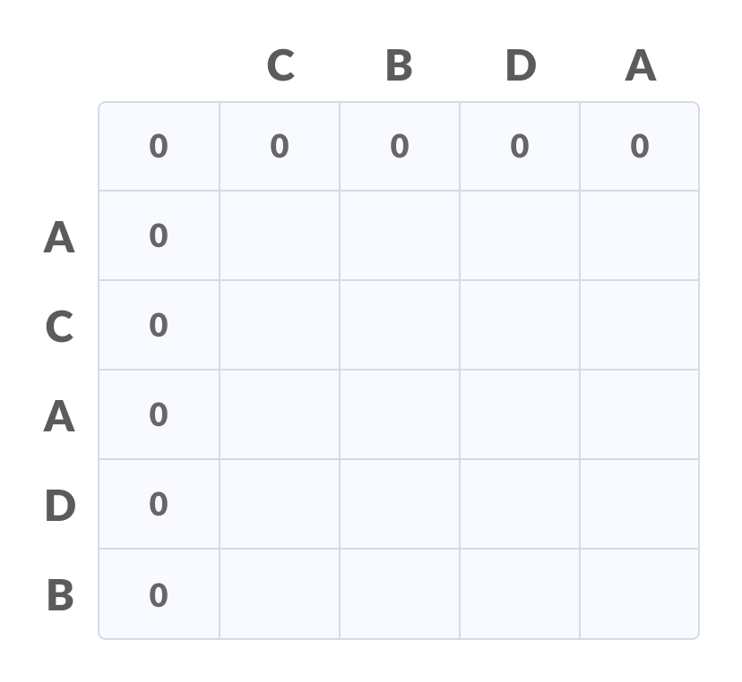
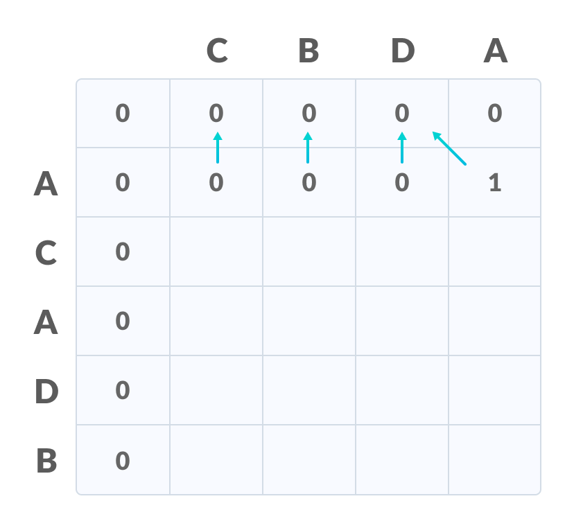
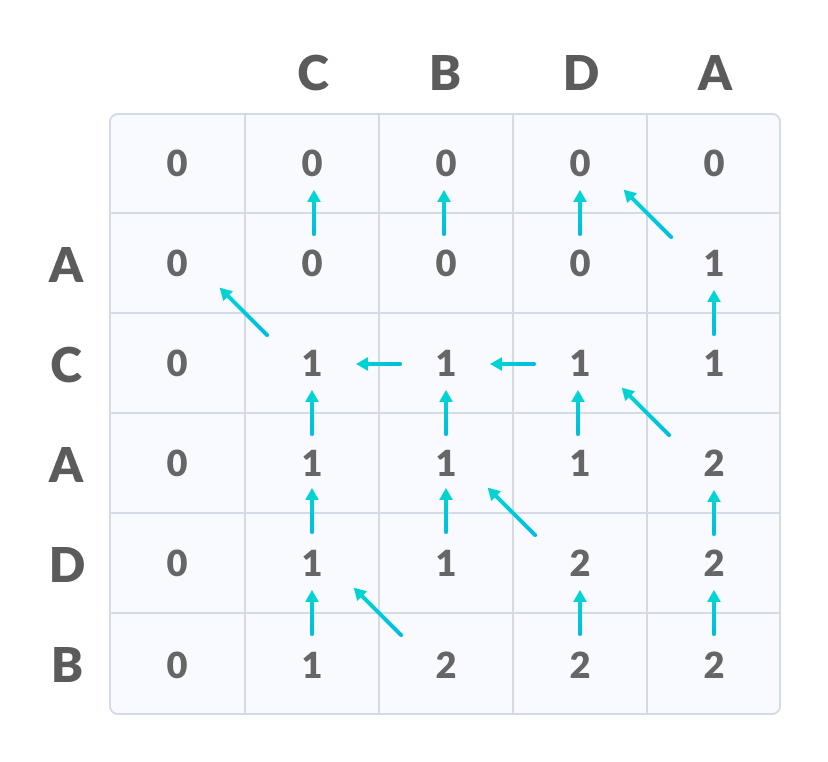
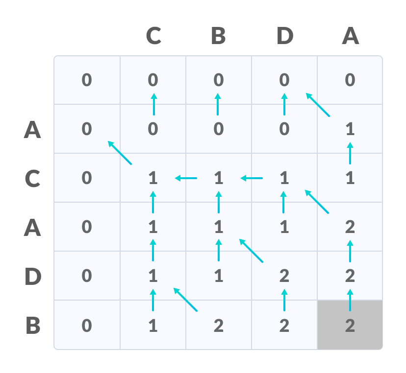
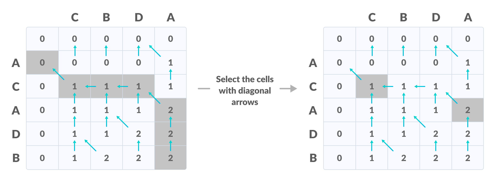

# Longest Common Subsequence

&nbsp;

## Pre-Requisites

1. __Subsequence__: A subsequence of a string S, is a set of characters that appear in left-to-right order, but not necessarily consecutively.  
    ex:

    >    S = `{A, C, T, T, G, C, G}`
    >
    >    `{A, C, T}`, `{A, T, T, C}`, `{T}`, `{A, C, T, T, G, C}` are all subsequences.
    >
    >    `{T, T, A}` is not a subsequence.

2. __Common Subsequence__: A common subequence of two strings is a subsequence that appears in both strings.    
    ex:    
    >    S1 = `{B, C, D, A, A, C, D}`
    >   
    >    S2 = `{A, C, D, B, A, C}`
    >
    >    Common Sequences are : `{B, C}, {C, D, A, C}, {D, A, C}, {A, A, C}, {A, C}, {C, D}, ...`

3. __Longest Common Subsequence (LCS)__: Alongest common subequenceis a common subsequenceof maximal length.    
    ex:    
    >    S1 = `{B, C, D, A, A, C, D}`
    >   
    >    S2 = `{A, C, D, B, A, C}`
    >
    >    LCS is : `{C, D, A, C} `

&nbsp;

## What does Longest Common Subsequence Algorithm do?

This algorithm comes under Dynamic Programming. Dynamic Programming is a technique in computer programming that helps to efficiently solve a class of problems that have overlapping subproblems and optimal substructure property.
Such problems involve repeatedly calculating the value of the same subproblems to find the optimum solution. 

Using this algorithm longest common subsequence can be found.

#### How Dynamic Programming Works?
Dynamic programming works by storing the result of subproblems so that when their solutions are required, they are at hand and we do not need to recalculate them.

&nbsp;

## Explanation

Let us take two sequences:

</img>
</img>

1. Create a table of dimension `n+1*m+1` where n and m are the lengths of `X` and `Y` respectively. The first row and the first column are filled with zeros. 

</img>

2. Fill each cell of the table using the following logic:
    - If the character correspoding to the current row and current column are matching, then fill the current cell by adding one to the diagonal element. Point an arrow to the diagonal cell.

    - Else take the maximum value from the previous column and previous row element for filling the current cell. Point an arrow to the cell with maximum value. If they are equal, point to any of them. 

</img>

3. Step 2 is repeated until the table is filled. 

</img>

4. The value in the last row and the last column is the length of the longest common subsequence. 

</img>

5. In order to find the longest common subsequence, start from the last element and follow the direction of the arrow. The elements corresponding to () symbol form the longest common subsequence. 

</img>

Thus the longest common subsequence is `CD`

</img>

&nbsp;

## Psuedo Code

&nbsp;

    X and Y be two given sequences
    Initialize a table LCS of dimension X.length * Y.length
    X.label = X
    Y.label = Y
    LCS[0][] = 0
    LCS[][0] = 0
    Start from LCS[1][1]
    Compare X[i] and Y[j]
        If X[i] = Y[j]
            LCS[i][j] = 1 + LCS[i-1, j-1]   
            Point an arrow to LCS[i][j]
        Else
            LCS[i][j] = max(LCS[i-1][j], LCS[i][j-1])
            Point an arrow to max(LCS[i-1][j], LCS[i][j-1])

