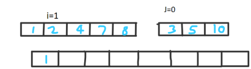
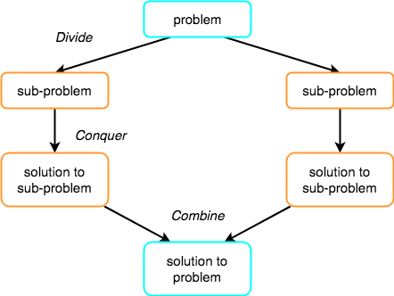

# MERGE SORT
**It is a sorting technique which is amazingly fast and uses divide and conquer rule (recursion) to solve it.**
## Why Merge sort?
- unlike other sort it has less time complexity
- this technique is more efficient when input size is very large
- time complexity of merge sort is O(nlogn)

## Prerequisites
1. **Basics of recursion**
2. **To merge two sorted arrays into third array**
   - Given two sorted arrays A1 and A2 of size n1 and n2 respectively. We have merged two arrays into the third array such it is also sorted.
        
      ```
      i=0;j=0;indexof_mergedarray=0 
      k=indexof_mergedarray
       merge[n1+n2]
  
      while i<n1 and j<n2 
       if A1[i] < A2[j]
          merged[k++] = A1[i++] 
       else
          merged[k++] = A2[j++] 
        ```
      We will compare A1[i] and A2[j] and insert smaller value into merged array and increment the corresponding index of that corresponding array whose value we incremented.
        
      After while loop executes, there can be sitution when one array has merged completely in the third array but other has some elements left. Hence, this can be soved by using another while loop that will traverse the elements which are left in the other array. 
      &nbsp;
        
      &nbsp;
      ``` 
      while i < n1 
        merged[k++] = A1[i++]; 
      while (j < n2) 
        merged[k++] = A2[j++];
        ```
        Hence, two sorted arrays get merged into the third array and finally we gets the sorted array as output.
        
## Explanation
Merge sort algorithm says that it will divide the array into two parts by finding the mid of given arrray. Then it will call the merge_sort function on two parts and return two sorted arrays. At last we will merge the two sorted arrays into the 3rd array and copy the 3rd array into orginal array. In this way, our array will get sorted.

Now let's have a look at the working of the algorithm:-

&nbsp;
  
&nbsp;
#### 1. Let's take an unsorted array
  
&nbsp;
#### 2. Divide the whole array into two parts. Here we will call merge_sort will divide the array into two equal parts by calculatng `mid=(starting_index+ending_index)/2` 
&nbsp;
 
&nbsp;
It will divide the array into two parts until the atomic values are obtained.
&nbsp;
 
&nbsp;
And finally we achieve the atomic values which can no more be divided.
&nbsp;
 
After achieving the atomic values, it hits the base case condition and finally merging starts.
#### 3. Merging of elements
The first element of both the lists are compared. If sorting has to be done in ascending order, the smaller element among two becomes a new element of the sorted list. This procedure is repeated until both the smaller sublists are emptied and the newly combined sublist covers all the elements of both the sublists.
&nbsp;
 
&nbsp;
In the next iteration of the combining phase, we compare the lists of two data values, and merge them into a list in sorted order using algorithm (given above in prerequisites) merge two soted arrays into the third array and copy the data of third array into the original array.
&nbsp;
 
&nbsp;
After merging, our array becomes sorted and looks like this.
&nbsp;
 
&nbsp;
<p align="center">

</p>
## Pseudo code

### Algorithm
```
Step 1 − if it is only one element in the list it is already sorted, hence return.
Step 2 − divide the list recursively into two halves until it can no more be divided.
Step 3 − merge the smaller lists into new lists in sorted order.
```
  ```
   MergeSort(A, starting_index,ending_index):
    p=starting_index
    r=ending_index
    if p > r 
        return
    mid = (p+r)/2
    mergeSort(A, p, q)
    mergeSort(A, q+1, r)
    merge(A, p, q, r)
  ```
 ## External Contents
 - Visualise using this [merge sort visualizers](https://www.hackerearth.com/practice/algorithms/sorting/merge-sort/visualize/)
 - view the [video](https://www.youtube.com/watch?v=TzeBrDU-JaY)

