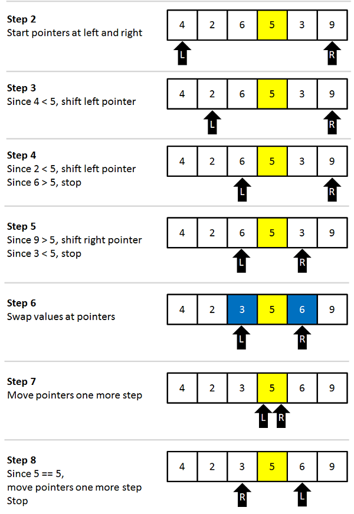
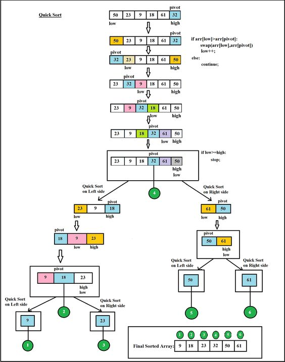

# QUICK SORT
**Quick sort is a highly efficient sorting and inplace algorithm . It is based upon partitioning of array of data into smaller arrays.**
## Why Quick sort?
- In previous algos, we saw merge sort which is based upon divide and conquer rule and which is not an inplace algorithm (the algorithm which does not take constant memory and which is dependent upon input size) but quick sort is an inplace algorithm.
- In average case, its time complexity is O(nlogn) and in worst case it is O(n^2) but we use optimised algo to avoid O(n^2).
- As it is highly efficient and fast, so most of language libraries use quick sort algorithm as their sort function.
## Pre-Requisites
- **Basics of recursion**

## Explanation
It is the algorithm based upon partition of array using pivot. We generally take first index as pivot but you can take last index too. We will place the pivot (zeroth index value) in array in such position that elements smaller than pivot are on left side of it and the elements greater than pivot are on its right side. If we will sort left side of pivot, right side of pivot and pivot is placed on correct position then our array will automatically get sorted.
The main aim is to do the partitioning of the array and returning the index where pivot is placed and call quick_sort function on both left and right remaining parts of array so that our whole array get sorted.

 #### 1. Check the base case
   - If the size of array is zero or one that means array is already sorted, so we will return.
 #### 2. Call the partion function and return the index of pivot
   -  We will pass starting_index, ending_index and unsorted array to it and take `pivot=arr[si]` and count the number of elements which are lesser than it. Let's take an example of unsorted array ` a[]={5,2,4,3,9} ` and `pivot=5`, we will count no of values less than pivot and `swap(a[si],a[si+count])`
   
   - This is our 1st step. Now arrange the elements in such a way that the elements with value less than pivot are on left side and the elements with values greater than pivot are on right.
   
&nbsp;
&nbsp;
<p align="center">
  
</p>
&nbsp;

```
        i=si
        j=ei
        while i < si+count and j > si+count
        do
        if input[i]<=input[si+count]
            i++
        else if input[j]>input[si+count]
                    j--
        else
        
            swap(input[i],input[j]);
            i++
            j--
   
```
By above algo, our elements get placed on their certain positions as explained above and we will return the index where pivot is placed.  
       
  #### 3. Call the quick_sort() function 
           
          
```
    c=pivot_index
    quick_sort(arr,si,c-1)
    quick_sort(arr,c+1,ei)
```   
Now we will call quick_sort() function on both sides and again array gets passed into partion function using recursion and at last our array will get sorted. 

Here's one more example at glance.


<p align="center">
  
</p>


<p align="center"> 

</p>

## Pseudo code
```
  partition(int input[],int si,int ei)

     count = 0
     i
     pivot = input[si]
    for i=si+1 to ei 
    do
        if(input[si]>=input[i])
        {
            count++
        }
    
  
    temp=input[si]
    input[si]=input[si+count]
    input[si+count]=temp;
    i=si
    j=ei
   while i < si+count and j > si+count
   do
       if(input[i]<=input[si+count])
         i++
       else if(input[j]>input[si+count])
           j--
       else
          swap(input[i],input[j]);
           i++
           j--
       
   
  return  si+count;

quick_sort(int input[],int si,int ei)

    if(si>=ei)
    {
        return;
    }
	int c;
    c=partition(input,si,ei);
	quick_sort(input,si,c-1);
    quick_sort(input,c+1,ei);
```

## External contentarray 

- [view the refence video ](https://www.youtube.com/watch?v=COk73cpQbFQ&t=342s)
- [view the visulazer ](https://www.hackerearth.com/practice/algorithms/sorting/quick-sort/visualize/)

---
