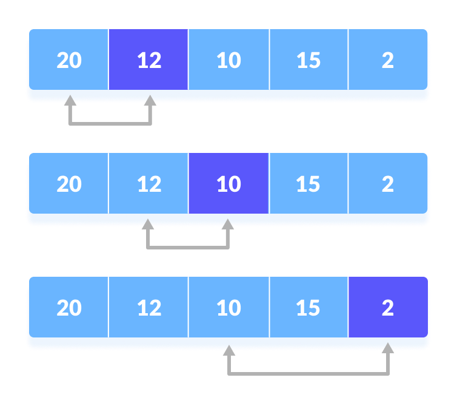
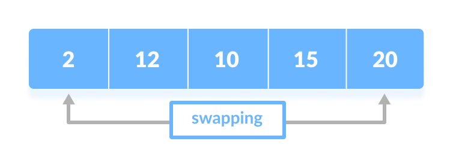
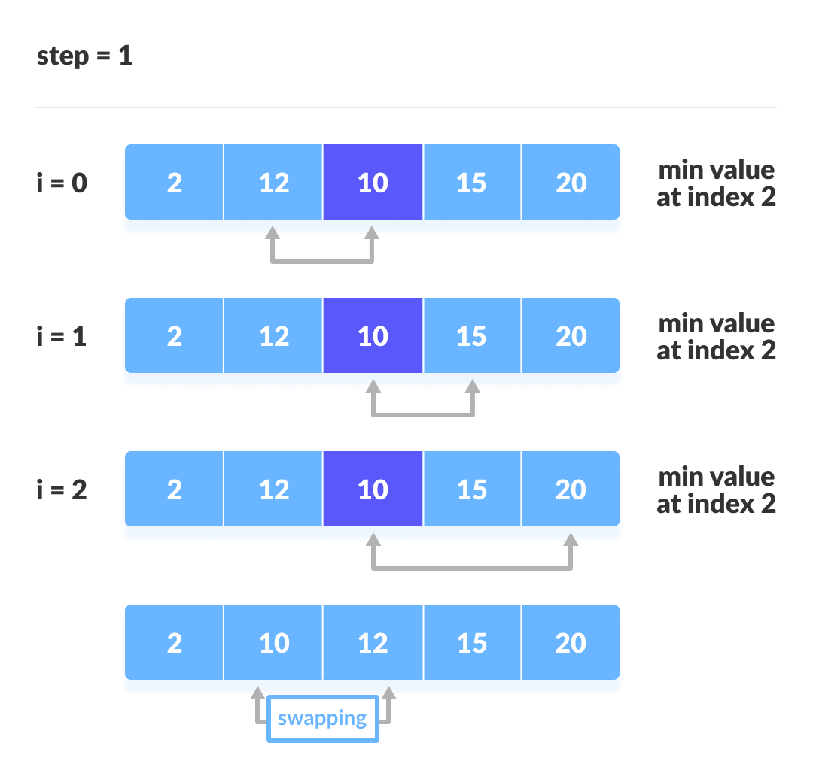
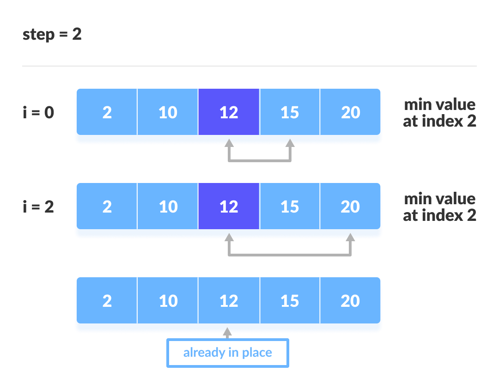
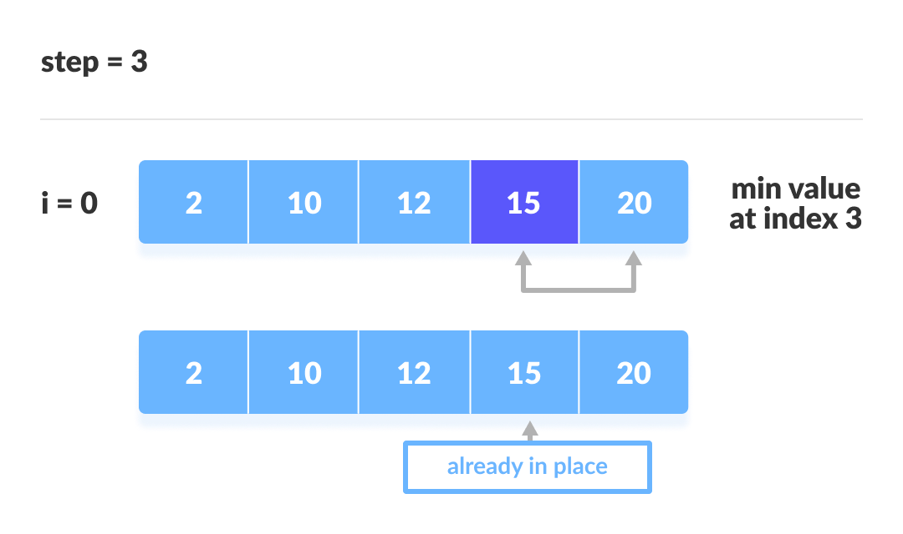

# Selection Sort

## What is Selection Sort ?

Selection sort is an algorithm that selects the smallest element from an unsorted list in each iteration and places that element at the beginning of the unsorted list.

## Pre-Requisites

-   Arrays
-   Python

## Explanation
How Selection Sort Works?

1. Set the first element as minimum.
   </img>
2. Compare minimum with the second element. If the second element is smaller than minimum, assign the second element as minimum.

Compare minimum with the third element. Again, if the third element is smaller, then assign minimum to the third element otherwise do nothing. The process goes on until the last element.
  </img>
  
3. After each iteration, minimum is placed in the front of the unsorted list.
  </img>
4. For each iteration, indexing starts from the first unsorted element. Step 1 to 3 are repeated until all the    elements are placed at their correct positions.
  </img>
  </img>
  </img>
  </img>

## Pseudo code

&nbsp;

  selectionSort(array, size)
  repeat (size - 1) times
  set the first unsorted element as the minimum
  for each of the unsorted elements
    if element < currentMinimum
      set element as new minimum
  swap minimum with first unsorted position
  end selectionSort   

## External content

[Programiz](https://www.programiz.com/dsa/selection-sort)
