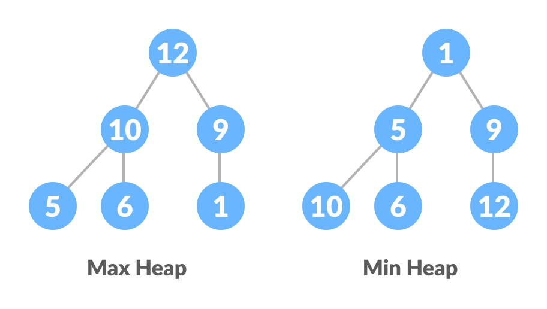
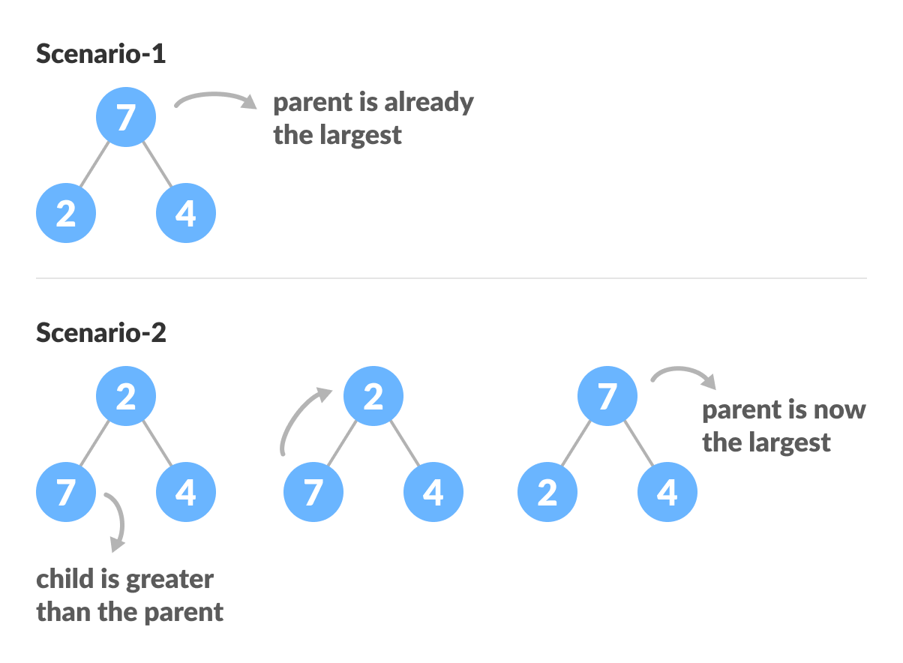
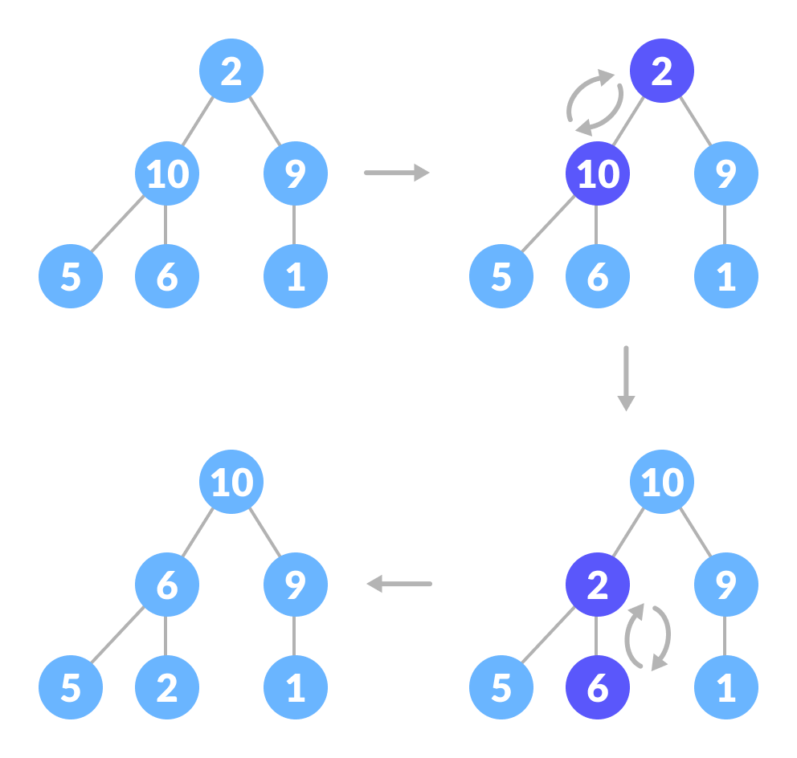

# Heapsort 

<p>&nbsp;</p>

## Pre-Requisites

1. __Binary Heaps__ : The (Binary) heap data structure is an array object that can be viewed as a nearly complete binary tree.

> A binary tree with n nodes and depth k is complete iff its nodes correspnd to the nodes numbered from 1 to n in the full binary tree of depth k.

2. __Heap Properties__ : There are two kinds of binary heaps: max-heaps and min-heaps.

    - In a max-heap, the max-heap property is that for every node i other than the root,    
    `A[Parent(i)] >= A[i]`

        - The largest element in a max-heap is stored at the root
        - The subtree rooted at a node contains values no larger than that contained at the node itself

    - In a min-heap, the min-heap property is that for every node i other than the root,    
    `A[Parent(i)] <= A[i]`
    
        - The largest element in a min-heap is stored at the root
        - The subtree rooted at a node contains values no larger than that contained at the node itself

    </img>

<p>&nbsp;</p>

## What is Heapsort? 
Heapsort is a widely used algorithm and it can be very effieciently used to sort the list of items by transforming it into a heap data structure, a binary tree with heap properties.

<p>&nbsp;</p>

## Why Heapsort?
- __Efficiency__: The Heap sort algorithm is very efficient. While other sorting algorithms may grow exponentially slower as the number of items to sort increase, the time required to perform Heap sort increases logarithmically. This suggests that Heap sort is particularly suitable for sorting a huge list of items. Furthermore, the performance of Heap sort is optimal. This implies that no other sorting algorithms can perform better in comparison.

- __Memory Usage__: The Heap sort algorithm can be implemented as an in-place sorting algorithm. This means that its memory usage is minimal because apart from what is necessary to hold the initial list of items to be sorted, it needs no additional memory space to work. In contrast, the Merge sort algorithm requires more memory space. Similarly, the Quick sort algorithm requires more stack space due to its recursive nature.

- __Simplicity__: The Heap sort algorithm is simpler to understand than other equally efficient sorting algorithms. Because it does not use advanced computer science concepts such as recursion, it is also easier for programmers to implement correctly.

- __Consistency__: The Heap sort algorithm exhibits consistent performance. This means it performs equally well in the best, average and worst cases. Because of its guaranteed performance, it is particularly suitable to use in systems with critical response time.

<p>&nbsp;</p>

## Explanation
The initial set of numbers that we want to sort is stored in an array e.g. `[15,6,52,33,62,12]` and after sorting, we get a sorted array `[6,12,15,33,52,62]`.

As we know, the heap sort woks by visualizing the elements of the array as a special kind of complete binary tree called a heap. Here's how we do it.
1. __Make Binary tree from Array__:
    If the index of any element in the array is `i`, the element in the index `2i+1` will become the left child and element in `2i+2` index will become the right child. Also, the parent of any element at index `i` is given by the lower bound of `(i-1)/2`.
    
</img>


2. __Heapify the tree__: 
    Starting from a complete binary tree, we can modify it to become a Max-Heap by running a function called heapify on all the non-leaf elements of the heap.

    ```
    heapify(array)
    Root = array[0]
    Largest = largest( array[0] , array [2*0 + 1], array [2*0+2])
    if(Root != Largest)
        Swap(Root, Largest)
    ```
    Procedure for a three element tree would be:

    </img>

    The example above shows two scenarios - one in which the root is the largest element and we don't need to do anything. And another in which the root had a larger element as a child and we needed to swap to maintain max-heap property.
    If you're worked with recursive algorithms before, you've probably identified that this must be the base case.
    Now let's think of another scenario in which there is more than one level.

    </img>

    The top element isn't a max-heap but all the sub-trees are max-heaps.
    To maintain the max-heap property for the entire tree, we will have to keep pushing 2 downwards until it reaches its correct position.

    </img>

    Thus, to maintain the max-heap property in a tree where both sub-trees are max-heaps, we need to run heapify on the root element repeatedly until it is larger than its children or it becomes a leaf node.

    So, after adding recursion:
    ```
    heapify(array)
    Root = array[0]
    Largest = largest( array[0] , array [2*0 + 1], array [2*0+2])
    if(Root != Largest)
        Swap(Root, Largest)
        heapify(array)
    ```

3. __Build Max-Heap__:
    To build a max-heap from any tree, we can thus start heapifying each sub-tree from the bottom up and end up with a max-heap after the function is applied to all the elements including the root element.

    In the case of a complete tree, the first index of a non-leaf node is given by `n/2 - 1`. All other nodes after that are leaf-nodes and thus don't need to be heapified.

    So, we can build a maximum heap as:
    ```
    for (int i = n / 2 - 1; i >= 0; i--)
        heapify(arr, n, i);
    ```
    </img>

    </img>
    
    </img>

4. __Swap and Remove__:
    - Since the tree satisfies Max-Heap property, then the largest item is stored at the root node.

    - _Swap_: Remove the root element and put at the end of the array (nth position) Put the last item of the tree (heap) at the vacant place.

    - _Remove_: Reduce the size of the heap by 1.
    
    - _Heapify_: Heapify the root element again so that we have the highest element at root.

    - The process is repeated until all the items of the list are sorted.

    </img>

    The code below shows the operation.
    ```
    for (int i = n - 1; i >= 0; i--) {
        swap(&arr[0], &arr[i]);
        heapify(arr, i, 0);
    }
    ```

<p>&nbsp;</p>

## Psuedo Code

<p>&nbsp;</p>

        Heapify(A as array, n as int, i as int)
        {
            max = i
            leftchild = 2i + 1
            rightchild = 2i + 2

            if (leftchild <= n) and (A[i] < A[leftchild])
                max = leftchild
            else 
                max = i

            if (rightchild <= n) and (A[max]  > A[rightchild])
                max = rightchild

            if (max != i)
                swap(A[i], A[max])
                Heapify(A, n, max)
        }

        Heapsort(A as array) 
        {
        n = length(A)
        for i = n/2 downto 1   
            Heapify(A, n ,i)
        
        for i = n downto 2
            exchange A[1] with A[i]
            A.heapsize = A.heapsize - 1
            Heapify(A, i, 0)
        }
